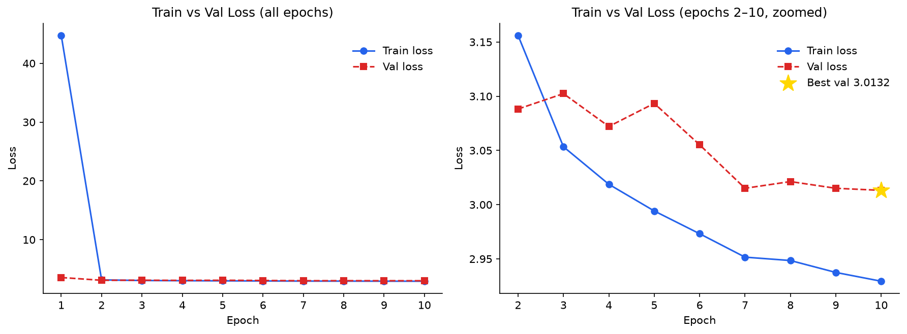
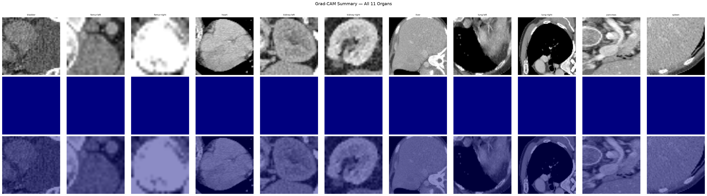

# OrganCAM

Fine-tuning [BioMedCLIP](https://huggingface.co/microsoft/BiomedCLIP-PubMedBERT_256-vit_base_patch16_224) on [OrganAMNIST](https://medmnist.com/) for zero-shot organ classification, then generating Grad-CAM pseudo-segmentation masks as weak supervision for downstream cancer detection.

## Results

| Model | Zero-Shot Accuracy |
|---|---|
| BioMedCLIP (pretrained, no fine-tuning) | 15.14% |
| BioMedCLIP (fine-tuned, epoch 9) | **96.28%** |

### Per-class accuracy (fine-tuned)

| Organ | Accuracy |
|---|---|
| Lung Left | 100.00% |
| Lung Right | 99.78% |
| Liver | 99.42% |
| Pancreas | 98.15% |
| Spleen | 98.25% |
| Femur Right | 97.73% |
| Heart | 97.45% |
| Kidney Right | 94.66% |
| Bladder | 92.76% |
| Femur Left | 89.80% |
| Kidney Left | 86.58% |

### Training curves



### Grad-CAM pseudo-masks



## Architecture

- **Backbone**: BioMedCLIP (ViT-B/16 visual encoder + PubMedBERT text encoder), 195M params
- **Fine-tuning**: Last 4 ViT blocks + last 4 BERT layers + projection heads — 57.5M / 195M trainable params
- **Loss**: SigLIP (pairwise sigmoid contrastive loss)
- **Zero-shot inference**: cosine similarity between image embeddings and 11 organ text templates
- **Pseudo-masks**: Grad-CAM on the last ViT block (`visual.trunk.blocks[-1]`), 14×14 → 224×224 bilinear upsample

## Setup

```bash
python -m venv .venv
.venv\Scripts\activate        # Windows
pip install torch torchvision --index-url https://download.pytorch.org/whl/cu128
pip install open_clip_torch medmnist matplotlib pytest
```

## Usage

### Fine-tune

```bash
python scripts/train.py --epochs 10 --batch_size 64 --device cuda
```

### Evaluate (zero-shot)

```bash
# Fine-tuned checkpoint
python scripts/evaluate.py

# Pretrained baseline (no fine-tuning)
python scripts/evaluate.py --baseline
```

### Generate Grad-CAM pseudo-masks

```bash
# Full test set (17,778 images)
python scripts/generate_masks.py --device cuda

# Quick smoke test
python scripts/generate_masks.py --limit 5 --device cuda
```

### Visualize masks

```bash
python scripts/visualize_masks.py                  # default: 60th-percentile threshold
python scripts/visualize_masks.py --threshold 70   # tighter masks
python scripts/visualize_masks.py --threshold 0    # no threshold (raw Grad-CAM)
```

### Plot training curves

```bash
python scripts/plot_training.py
```

## Project structure

```
src/
  data/           OrganAMNIST loader
  labels/         class names + zero-shot text templates
  training/       Trainer, freeze schedule
  explainability/ BioMedCLIPGradCAM
scripts/
  train.py        fine-tuning entrypoint
  evaluate.py     zero-shot evaluation
  generate_masks.py  batch Grad-CAM mask generation
  visualize_masks.py overlay visualizations
  plot_training.py   training curve figures
  plot_eval.py       per-class accuracy bar chart
tests/
  test_gradcam.py smoke tests for Grad-CAM engine
results/
  eval_results.json  full evaluation metrics
figures/
  epoch_loss_curves.png
  per_epoch_batch_curves.png
  global_batch_loss.png
  epoch_timing.png
  per_class_accuracy.png
  gradcam/           per-class and summary Grad-CAM overlays
```

## Dataset

OrganAMNIST (axial CT, 28×28 → resized to 224×224):
- Train: 34,561 | Val: 6,491 | Test: 17,778
- 11 classes: bladder, femur-left, femur-right, heart, kidney-left, kidney-right, liver, lung-left, lung-right, pancreas, spleen

Checkpoints and generated masks (~10GB total) are excluded from this repo — run the scripts above to reproduce them.
